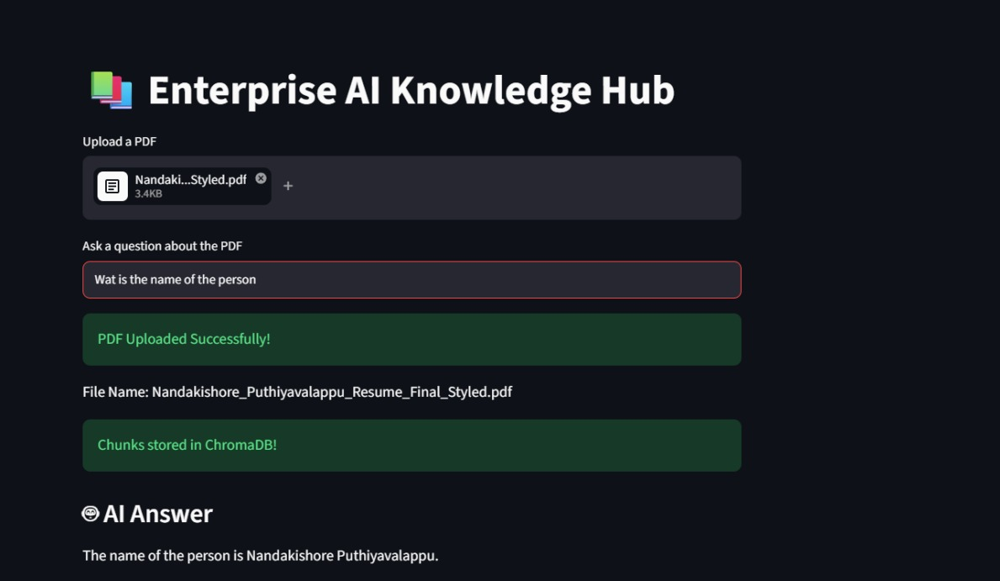
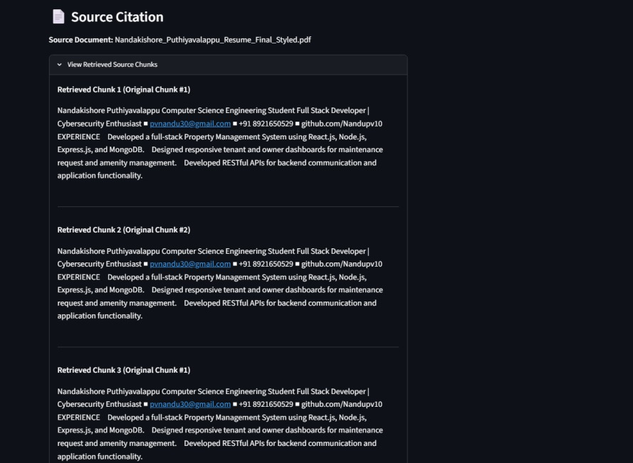
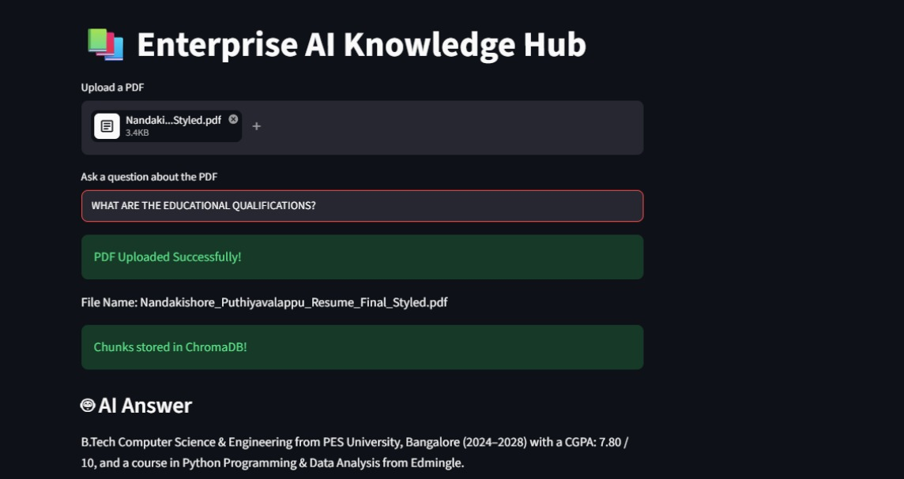
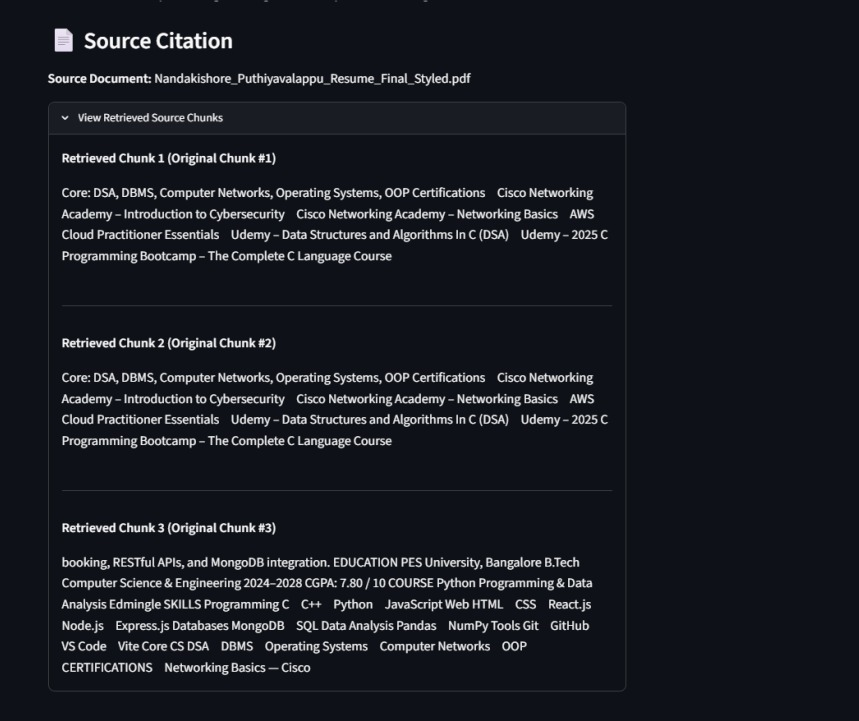
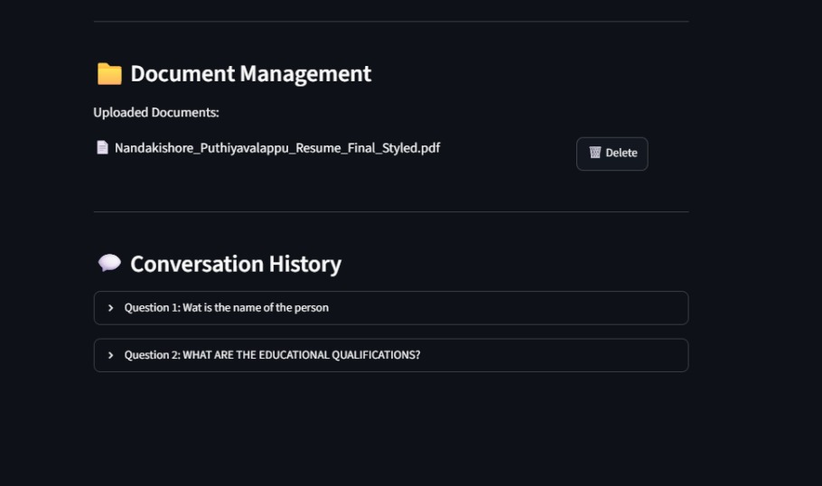

# 📚 Enterprise AI Knowledge Hub

An AI-powered document question-answering application that allows users to upload PDF documents and ask questions based on their content.

The application uses Retrieval-Augmented Generation (RAG) to retrieve relevant information from uploaded documents and generate context-aware answers.

## 🚀 Features

- Upload and process PDF documents
- Extract text automatically using PyPDF
- Split large documents into smaller text chunks
- Generate vector embeddings using Hugging Face
- Store and retrieve document embeddings using ChromaDB
- Perform similarity search to find the most relevant document chunks
- Generate answers using Llama through the Groq API
- Interactive web interface built with Streamlit
- Prevents answers based on outside information by instructing the model to use only retrieved PDF context

## 🛠️ Technologies Used

- Python
- Streamlit
- LangChain
- Hugging Face Embeddings
- ChromaDB
- Groq API
- Llama 3.3 70B
- PyPDF

## 🧠 How It Works

The application follows a Retrieval-Augmented Generation (RAG) pipeline:

```text
PDF Upload
    ↓
Text Extraction using PyPDF
    ↓
Text Chunking
    ↓
Hugging Face Embeddings
    ↓
ChromaDB Vector Storage
    ↓
Similarity Search
    ↓
Top 3 Relevant Chunks Retrieved
    ↓
Groq API + Llama
    ↓
AI-Generated Answer
```

## 📦 Installation

### 1. Clone the repository

```bash
git clone https://github.com/Nandupv10/Enterprise-AI-Knowledge-Hub.git
```

### 2. Navigate to the project directory

```bash
cd Enterprise-AI-Knowledge-Hub
```

### 3. Install the required dependencies

```bash
pip install -r requirements.txt
```

### 4. Create a `.env` file

Add your Groq API key:

```env
GROQ_API_KEY=your_groq_api_key_here
```

### 5. Run the application

```bash
streamlit run app.py
```

## 📖 Usage

1. Upload a PDF document.
2. Wait for the document to be processed and stored in ChromaDB.
3. Enter a question related to the uploaded PDF.
4. The application retrieves the most relevant chunks from the document.
5. Llama generates an answer using the retrieved context.

## 🔐 Security

API keys are stored locally in a `.env` file and excluded from GitHub using `.gitignore`.

## 👨‍💻 Author

**Nandakishore Puthiyavalappu**

B.Tech Computer Science and Engineering  
PES University


---

## 📸 Application Screenshots

### Test Case 1: Person Name Retrieval

The user asks for the person's name, and the RAG system retrieves relevant document context to generate an accurate answer.



### Source Citation and Retrieved Chunks

The application displays the source PDF and the top relevant chunks retrieved from ChromaDB.



---

### Test Case 2: Educational Qualifications Retrieval

The user asks about educational qualifications, and the system generates an answer using only the retrieved PDF context.



### Source Citation and Retrieved Chunks

The application displays the relevant source chunks used to generate the educational qualifications answer.



### Document Management and Conversation History

The application provides basic document management and maintains the conversation history for questions asked during the current session.


